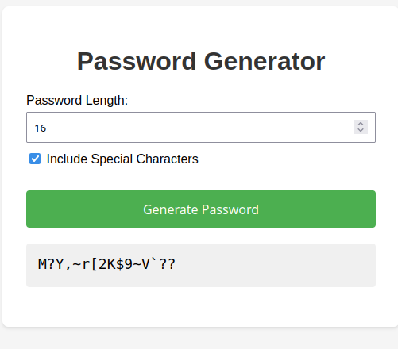
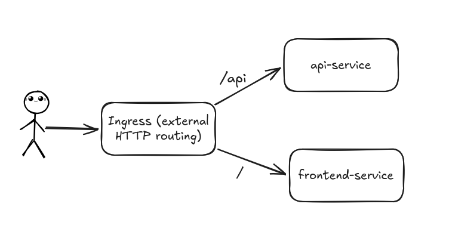
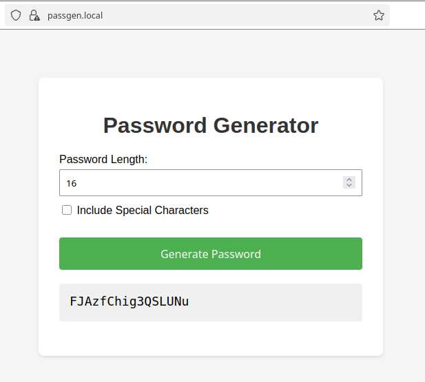
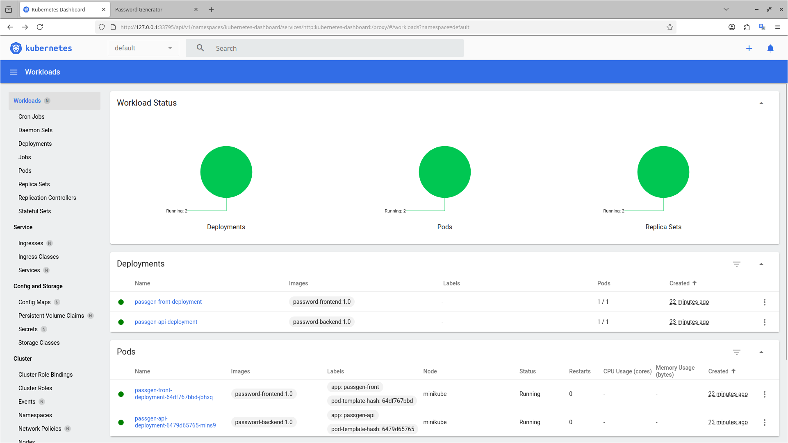
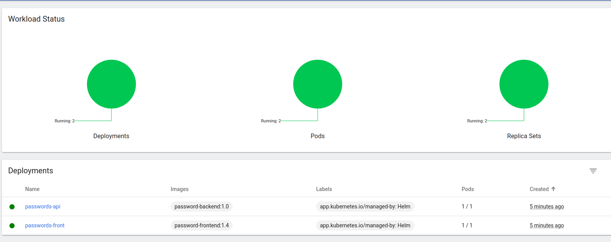
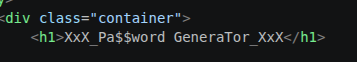
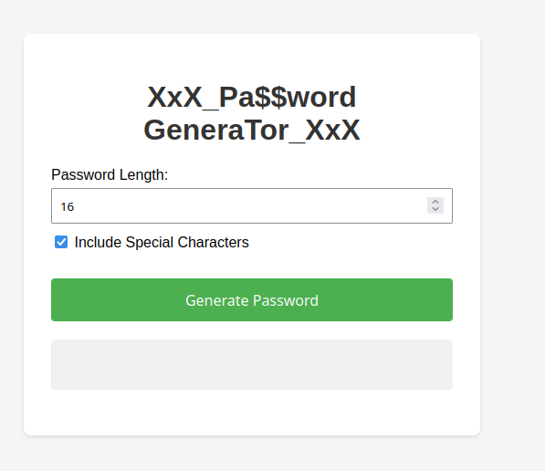

# 2 Лабораторная работа

## 1 часть. Поднимаем kubernetes кластер

Для выполнения лабы я навайбкодил простое приложения для генерации пароля. 



Оно состоит из API и одностраничного сайта.

В API только один эндпоинт: `"/generate-password?length=...&include_special=..."`

Dockerfiles:

```Dockerfile
FROM python:3.12-alpine
WORKDIR /app

COPY requirements.txt .
RUN pip install --no-cache-dir -r requirements.txt

COPY . .

EXPOSE 8000

CMD ["uvicorn", "main:app", "--host", "0.0.0.0", "--port", "8000"]
```
---
```Dockerfile
FROM nginx:1.29-alpine

COPY index.html /usr/share/nginx/html/index.html

EXPOSE 80
```

### 1.1 как это должно работать?

Как было сказано, приложение разделено на frontend и backend. Пользователь напрямую обращаеся к web-серверу за статическими файлами и к API.

Следовательно необходимо предоставить доступ извне к обоим сервисам.

Примерно так:



### 1.1 Пишем yaml'ки

**API:**
Создадим deployment:

```yaml
apiVersion: apps/v1
kind: Deployment
metadata:
  name: passgen-api-deployment
spec:
  replicas: 1 # количество работающих подов
  selector: # 'фильтр' по которым ищутся поды
    matchLabels:
      app: passgen-api
  template:
    metadata:
      labels: # на каждый под вещаем метку
        app: passgen-api
    spec:
      containers:
        - name: password-backend # назначаем имя контейнера внутри пода
          image: password-backend:1.0
          ports:
            - containerPort: 8000
```
и service:
```yaml
apiVersion: v1
kind: Service
metadata:
  name: passgen-api-service
spec:
  type: ClusterIP # устанавливаем доступ только внутри кластера
  selector:
    app: passgen-api
  ports:
    - port: 8000
      targetPort: 8000
```

**Front-end:**

deployment:
```Yaml
apiVersion: apps/v1
kind: Deployment
metadata:
  name: passgen-front-deployment
spec:
  replicas: 1
  selector:
    matchLabels:
      app: passgen-front
  template:
    metadata:
      labels:
        app: passgen-front
    spec:
      containers:
        - name: password-frontend
          image: password-frontend:1.0
          ports:
            - containerPort: 80
```

и service:

```yaml
apiVersion: v1
kind: Service
metadata:
  name: passgen-front-service
spec:
  type: ClusterIP
  selector:
    app: passgen-front
  ports:
    - port: 80
      targetPort: 80
```

### 1.2 Ingress

Для того, чтобы работать с ingress необходимо его включить:
```Bash
minikube addons enable ingress
```

Далее напишем yaml:

```yaml
apiVersion: networking.k8s.io/v1 # группа правил для ingress
kind: Ingress
metadata:
  name: passgen-ingress
spec:
  rules:
    - host: passgen.local # устанавливаем правила для этого домена
      http:
        paths:
          - path: / # статические файлы
            pathType: Prefix # все запросы, которые начинаются с /
            backend:
              service:
                name: passgen-front-service # перенаправляем на этот сервис
                port:
                  number: 80
          - path: /api # апишка
            pathType: Prefix
            backend:
              service:
                name: passgen-api-service
                port:
                  number: 8000
```

### 1.3 Запускаем и тестируем

```bash
kubectl apply -f api-deployment.yaml
kubectl apply -f api-service.yaml
kubectl apply -f front-deployment.yaml
kubectl apply -f front-service.yaml 
kubectl apply -f ingress-resource.yaml 
```

Добавляем `passgen.local` в `/etc/hosts`

И открываем сайт:


Также проверим дашборд:


Как видно, все работает.

В итоге были использованы следующие ресурсы kubernetes:
- Deployments
- Services
- Ingress

## 2 часть. HELM

### 2.1 Создаем chart

Создадим новую папку `/helm` со следующей структурой:
```
/helm
├── Chart.yaml
├── templates
│   ├── api-deployment.yaml
│   ├── api-service.yaml
│   ├── front-deployment.yaml
│   ├── front-service.yaml
│   └── ingress-resource.yaml
└── values.yaml
```

Chart.yaml
```yaml
apiVersion: v2
name: passgen-chart
version: 0.1.0
description: password generator helm chart
```

values.yaml
```yaml
ingress:
  host: passgen.local

api:
  image: password-backend
  tag: "1.0"
  port: 8000

frontend:
  image: password-frontend
  tag: "1.4"
  port: 80
```

templates/api-deployment.yaml
```yaml
apiVersion: apps/v1
kind: Deployment
metadata:
  name: {{ .Release.Name }}-api
spec:
  replicas: 1
  selector:
    matchLabels:
      app: {{ .Release.Name }}-api
  template:
    metadata:
      labels:
        app: {{ .Release.Name }}-api
    spec:
      containers:
        - name: api
          image: {{ .Values.api.image }}:{{ .Values.api.tag }}
          ports:
            - containerPort: 8000
```

templates/api-service.yaml
```yaml
apiVersion: v1
kind: Service
metadata:
  name: {{ .Release.Name }}-api-service
spec:
  type: ClusterIP
  selector:
    app: {{ .Release.Name }}-api
  ports:
    - port: {{ .Values.api.port }}
      targetPort: 8000
```

templates/front-deployment.yaml
```yaml
apiVersion: apps/v1
kind: Deployment
metadata:
  name: {{ .Release.Name }}-front
spec:
  replicas: 1
  selector:
    matchLabels:
      app: {{ .Release.Name }}-front
  template:
    metadata:
      labels:
        app: {{ .Release.Name }}-front
    spec:
      containers:
        - name: frontend
          image: {{ .Values.frontend.image }}:{{ .Values.frontend.tag }}
          ports:
            - containerPort: 80
```

templates/front-service.yaml
```yaml
apiVersion: v1
kind: Service
metadata:
  name: {{ .Release.Name }}-frontend-service
spec:
  type: ClusterIP
  selector:
    app: {{ .Release.Name }}-front
  ports:
    - port: {{ .Values.frontend.port }}
      targetPort: 80
```

templates/ingress-resource.yaml
```yaml
apiVersion: networking.k8s.io/v1
kind: Ingress
metadata:
  name: {{ .Release.Name }}-ingress
spec:
  rules:
    - host: {{ .Values.ingress.host }}
      http:
        paths:
          - path: /
            pathType: Prefix
            backend:
              service:
                name: {{ .Release.Name }}-frontend-service
                port:
                  number: {{ .Values.frontend.port }}
          - path: /api
            pathType: Prefix
            backend:
              service:
                name: {{ .Release.Name }}-api-service
                port:
                  number: {{ .Values.api.port }}
```

Далее выполняем `helm install passwords ./helm` и видим, что helm работает



### 2.2 Выполняем обновление

Добавим косметические изменения на фронтенде



Соберем новый образ докера

```bash
docker build -t password-frontend:1.5 .
```

Изменим значение `frontend.tag` на 1.5

и выполним 

```bash
helm upgrade passwords ./helm
```

И видим новый, улучшенный пользовательский интерфейс



**Конец**

Все файлы находятся в папке /code