# 3 Лабораторная работа
## 1 Часть. Настройка Nginx

### 1.1. Простейшая конфигурация
Первым делом установим Nginx и проверим статус:
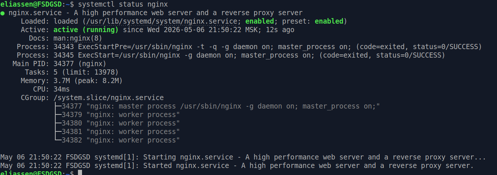

В качестве приложения для развертывания будет использоваться мое заброшенное приложения для хранения заметок (https://github.com/7eliassen/VaultNote).

Создадим `/etc/nginx/sites-aviable/vault-note.conf` с простейшей конфигурацией:
```nginx
server {
    listen 80;
    server_name vault-note.test;

    root /var/www/vault-note;
    index index.html;

    location / {
        try_files $uri $uri/ /index.html;
    }
}
```

И создадим ссылку на конфигурацию в `/etc/nginx/sites-enabled`

Как видно, статические файлы раздаются:
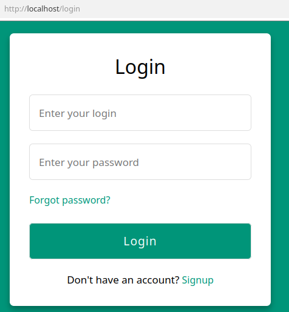

### 1.2 Подключаем HTTPS

Для настройки TLS сертификата воспользуемся утилитой `mkcert`, которая локально создает подписанные сертификаты. Так как приложение разворачивается исключительно в учебных целях такой метод удовлетворителен.

Выполним:
```bash
./mkcert --install
./mkcert vault-note.test
```

Получившиеся сертификаты поместим в `/etc/nginx/ssl/`.

Теперь изменим наш конфиг:
```nginx
server {
    listen 443 ssl; # Поставим стандартный https порт и включим ssl
    ...
    ssl_certificate /etc/nginx/ssl/vault-note.test.pem; # Публичный сертификат
    ssl_certificate_key /etc/nginx/ssl/vault-note.test-key.pem; # Приватный ключ
    ssl_protocols TLSv1.2 TLSv1.3; # Разрешаем TLS только последних версий
    ...
```

Также добавим перенаправление с http на https: 
```nginx
server {
    listen 80;
    server_name vault-note.test;
    return 301 https://$server_name$request_uri;
}
```

И добавим в `/etc/hosts`:
```
127.0.0.1 vault-note.test
```
Потому что не хочу регистрировать домен.

Как видно, теперь https работает:
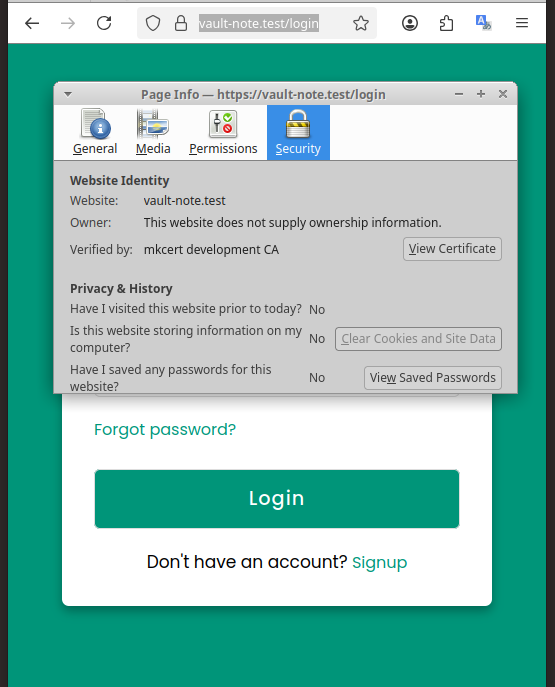

И перенаправление тоже:
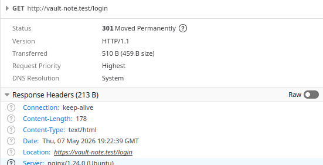

### 1.3 Настраиваем alias

Одним из требований к лабораторной работе является использование директивы `alias`.

Допустим по какой-то причине мы решили распределить js и css файлы по разным директориям:
Было:
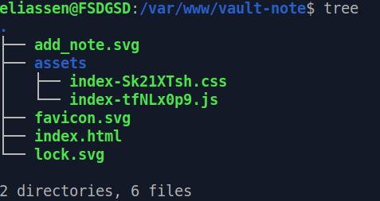
Стало:
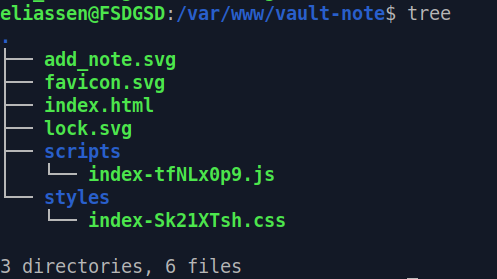

Теперь добавим в нашу конфигурацию новые `location`:
```nginx
location ~ ^/assets/(.*)\.js$ {
    alias /var/www/vault-note/scripts/$1.js;
}

location ~ ^/assets/(.*)\.css$ {
    alias /var/www/vault-note/scripts/$1.css;
}
```

### 1.4 Донастраиваем приложение

Для приложения также нужен развернутый api.

По адресу `localhost:8000` запустим докер контейнер с api:
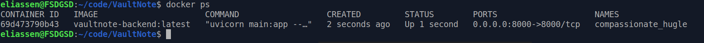

И пропишем новый `location` в нашем конифиге:
```nginx
    location /api/ {
        proxy_pass http://localhost:8000/;
        # Пробрасываем api реальные данные о запросе
        proxy_set_header Host $host;
        proxy_set_header X-Real-IP $remote_addr;
        proxy_set_header X-Forwarded-For $proxy_add_x_forwarded_for;
        proxy_set_header X-Forwarded-Proto $scheme;
```

Теперь приложение полностью функционирует:
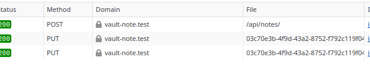

### 1.5 Несколько хостов

Далее необходимо добавить еще приложение.

Как ранее, сгенерируем сертификаты и добавим их в `/etc/nginx/ssl`

Далее напишем новый конифг `pass-gen.conf`:
```nginx
server {
    listen 443 ssl;
    server_name passgen.test;

    ssl_certificate /etc/nginx/ssl/passgen.test.pem;
    ssl_certificate_key /etc/nginx/ssl/passgen.test-key.pem;
    ssl_protocols TLSv1.2 TLSv1.3;

    root /var/www/passgen;
    index index.html;

    location /api/ {
        proxy_pass http://localhost:8001;
        proxy_set_header Host $host;
        proxy_set_header X-Real-IP $remote_addr;
        proxy_set_header X-Forwarded-For $proxy_add_x_forwarded_for;
        proxy_set_header X-Forwarded-Proto $scheme;
    }

    location / {
        try_files $uri $uri/ =404;
    }
}

server {
    listen 80;
    server_name passgen.test;
    return 301 https://$server_name$request_uri;
}

```

Также запустим api на 8001 порту:
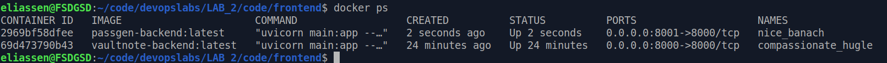

Как видно оба приложения успешно работают на одном сервере, используя виртуальные домены. Оба работают с https и проксированием запросов на api.

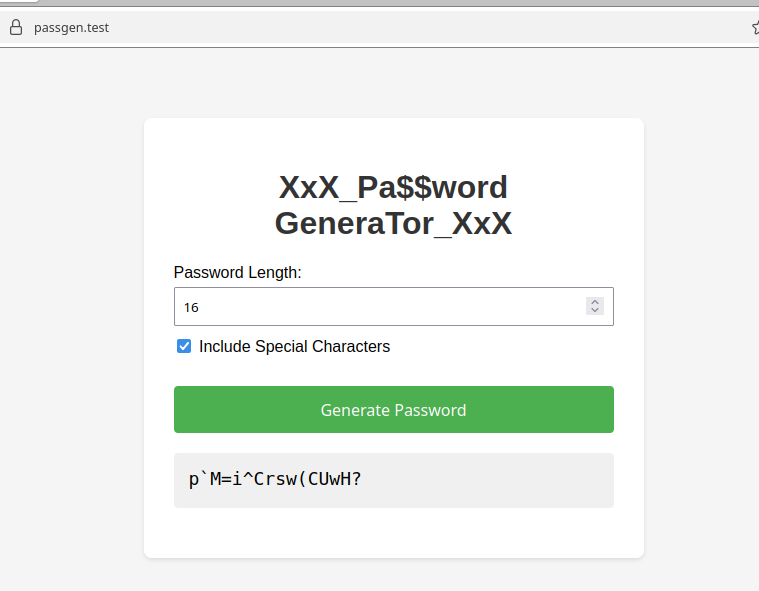

Конечный конфиг `vault-note.conf`:
```nginx
server {
    listen 443 ssl;
    server_name vault-note.test;

    ssl_certificate /etc/nginx/ssl/vault-note.test.pem;
    ssl_certificate_key /etc/nginx/ssl/vault-note.test-key.pem;
    ssl_protocols TLSv1.2 TLSv1.3;

    root /var/www/vault-note;
    index index.html;

    location ~ ^/assets/(.*)\.js$ {
        alias /var/www/vault-note/scripts/$1.js;
    }

    location ~ ^/assets/(.*)\.css$ {
        alias /var/www/vault-note/styles/$1.css;
    }

    location /api/ {
        proxy_pass http://localhost:8000/;
        proxy_set_header Host $host;
        proxy_set_header X-Real-IP $remote_addr;
        proxy_set_header X-Forwarded-For $proxy_add_x_forwarded_for;
        proxy_set_header X-Forwarded-Proto $scheme;
    }

    location / {
        try_files $uri $uri/ /index.html;
    }
}

server {
    listen 80;
    server_name vault-note.test;
    return 301 https://$server_name$request_uri;
}
```

## 2 Часть. Взламываем сайты 😁

### 2.1 Path traversal

Для начала было решено проверить запущенные мной приложения.

В конфигурации `vault-note.conf` мы дважды используем `alias`.
В данном случае можно подставить путь, содержащий `..`, чтобы подняться выше по директориям и прочитать файлы, доступа к которым у нас быть не должно (к сожалению в данном случае, только .js/.css файлы).

Создадим файл `/tmp/test.js` и попробуем получить к нему доступ:
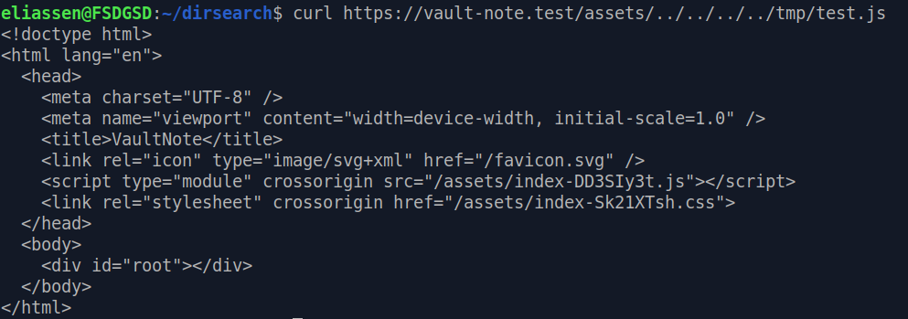

Лог (request_uri, uri, document_uri):
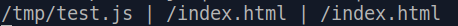

Проблема заключается в том, что nginx нормализует uri, перед обработкой location, поэтому наш запрос уже не попадает в выражение `^/assets/(.*)\.js$`

Попробуем обойти эту проблему, закодировав `/` в url:
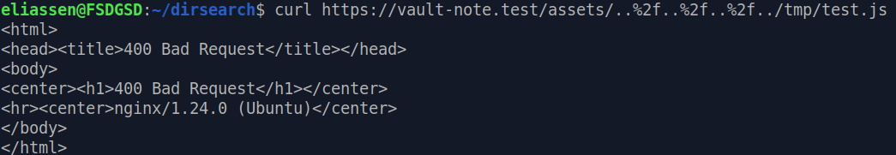

Теперь nginx вообще не обрабатывает запрос.

Попробуем закодировать `%2f`:
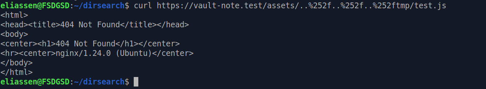

Лог:
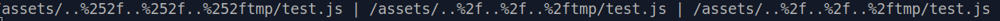

Декодирование происходит только 1 раз и `/` так и остается закодирован в url. 

Можно заключить, что уязвимость path traversal не подтвердилась.

### 2.2 Перебор страниц

Был выбран сайт случайной школы и проведен перебор страниц:
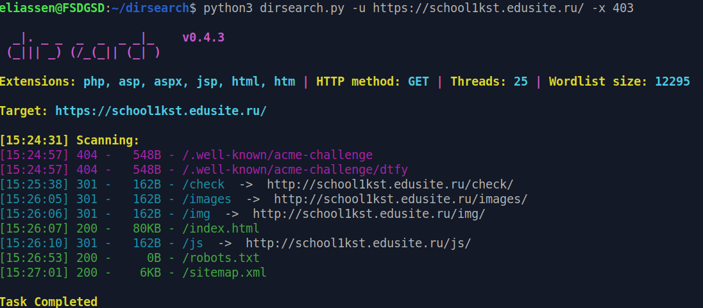
Однако ничего интересного небыло найдено

### 2.3 Path Traversal 2?

На странице был найден uri:`/mmagic.html?page=/sveden/common.html`.
Возникла идея о том, что сайт читает заданный параметром page файл с сервера.
Также в исходном коде страницы был найден комментарий:
```html 
<!-- 4.6.92 (01.04.2026, Windows 10  (v10.0.19045)), magic -->
```

Исходя из чего можно предположить, какие файлы потенциально можно скачать.

Однако в ходе дальнейшей разведки был найден js скрипт, отвечающий за данный функционал. Оказалось это AJAX, подгружающий блок html кода внутрь основной страницы. Так что никакой информации с сервера получить не получиться.