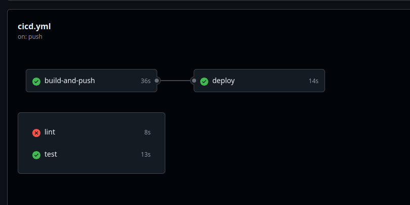
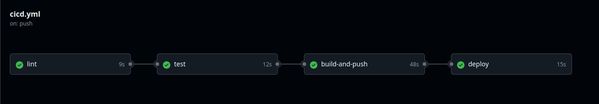
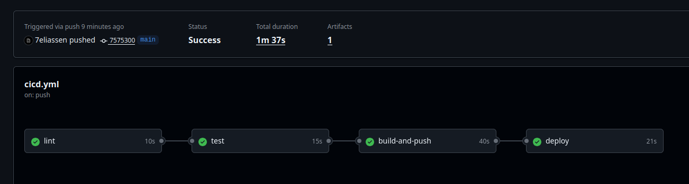
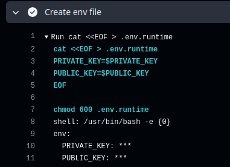
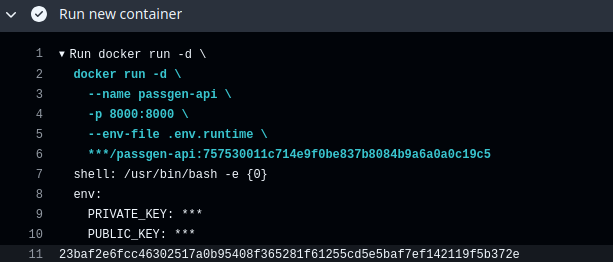

# 4 Лабораторная работа
## 1 Часть. Архитектура приложения

Для выполнения данной лабораторной работы будем использовать сервис для генерации пароля, который уже использовался во 2-ой лабе.
Продублирую Dockerfile:
```Dockerfile
FROM python:3.12-alpine
WORKDIR /app

COPY requirements.txt .
RUN pip install --no-cache-dir -r requirements.txt

COPY . .

EXPOSE 8000

CMD ["uvicorn", "main:app", "--host", "0.0.0.0", "--port", "8000"]

```

Также добавим парочку unit-тестов:
```python
from fastapi.testclient import TestClient
from main import app

client = TestClient(app)

def test_generate_password_default():
    response = client.get("/api/generate-password")
    assert response.status_code == 200
    data = response.json()
    assert len(data["password"]) == 16

def test_generate_password_length():
    response = client.get("/api/generate-password?length=20")
    assert response.status_code == 200
    data = response.json()
    assert len(data["password"]) == 20

def test_not_found():
    response = client.get("/api/not-existed")
    assert response.status_code == 404
```

Также добавим в наш проект python-линтер ruff.

`pyproject.toml`:
```python
[tool.ruff]
line-length = 80 # Ограничение на длину строки

[tool.ruff.lint]
select = ["E", "F", "I"] # Различные проверки кода
```

Далее перейдем к настройке пайплайнов. Для этого будет использоваться github actions.

## 2 Часть. Создаем CI\CD

Был написан CI\CD пайплан, который при push в ветку main:
- Проверяет код с помощью линтера
- Выполняет юнит тесты
- Собирает образ и деплоит его в репозиторий docker
- Подтягивает образ и запускает его на self-hosted runner'е

```yaml
name: CI\CD pipeline
on:
  push:
    branches: [main]

jobs:
  lint:
    runs-on: ubuntu-latest
    steps:
      - uses: actions/checkout@main

      - name : Set up Python
        uses: actions/setup-python@main
      - name: Install dependencies
        run: |
          pip install pytest ruff

      - name: Start linting
        run: ruff check .

  test:
    runs-on: ubuntu-latest
    steps:
      - uses: actions/checkout@main

      - name : Set up Python
        uses: actions/setup-python@main
      - name: Install dependencies
        run: |
          pip install -r requirements.txt

      - name: Start testing
        run: pytest -q

  build-and-push:
    runs-on: ubuntu-latest
    steps:
      - name: Login to Docker Hub
        uses: docker/login-action@v4
        with:
          username: ${{ secrets.DOCKERHUB_USERNAME }}
          password: ${{ secrets.DOCKERHUB_TOKEN }}
      - name: Set up QEMU
        uses: docker/setup-qemu-action@v4

      - name: Set up Docker Buildx
        uses: docker/setup-buildx-action@v4

      - name: Build and push
        uses: docker/build-push-action@v7
        with:
          file: Dockerfile
          push: true
          tags: ${{ secrets.DOCKERHUB_USERNAME }}/passgen-api:latest

  deploy:
    runs-on: self-hosted
    needs: build-and-push

    steps:
      - name: Pull Docker screens/image
        run: docker pull ${{ secrets.DOCKERHUB_USERNAME }}/passgen-api:latest

      - name: Stop old container
        run: docker stop passgen-api || true

      - name: Remove old container
        run: docker rm passgen-api || true

      - name: Run new container
        run: |
          docker run -d \
            --name passgen-api \
            -p 8000:8000 \
            ${{ secrets.DOCKERHUB_USERNAME }}/passgen-api:latest
```

В данном файле есть следующие bad-practise:
- Отсутствие версионирования образа и использование тега latest: образ постоянно перезаписывается, нет возможности откатиться назад.
- Не заданы версии python для test и lint.
- Не указаны версии для actions. Вместо них стоит @main
- Отсутствие кеширования зависимостей pip.
- В deploy мы подтягиваем latest образ. Нет четкой связи образа, который мы загружаем и устанавливаем.
- Отсутствие зависимости между job'ами: Так, даже если линтер или тесты не пройдут, образ всеравно будет задеплоен.

Как видно, pipeline работает, несмотря не перечисленные недостатки:


Исправленный вариант:
```yaml
name: CI/CD pipeline

on:
  push:
    branches: [main]

jobs:
  lint:
    runs-on: ubuntu-latest
    steps:
      - uses: actions/checkout@v4

      - name: Set up Python
        uses: actions/setup-python@v5 # Указали версию
        with:
          python-version: "3.12" # Установили конкретную версию python
          cache: "pip" # Включили кэширование зависимостей

      - name: Install dependencies
        run: pip install pytest ruff

      - name: Start linting
        run: ruff check .


  test:
    runs-on: ubuntu-latest
    needs: lint # Добавлены зависимости

    steps:
      - uses: actions/checkout@v4

      - name: Set up Python
        uses: actions/setup-python@v5 # Указали версию
        with:
          python-version: # Установили конкретную версию python
          cache: "pip" # Включили кэширование зависимостей

      - name: Install dependencies
        run: pip install -r requirements.txt

      - name: Start testing
        run: pytest -q


  build-and-push:
    runs-on: ubuntu-latest
    needs: test # Добавлены зависимости

    steps:
      - uses: actions/checkout@v4

      - name: Login to Docker Hub
        uses: docker/login-action@v4
        with:
          username: ${{ secrets.DOCKERHUB_USERNAME }}
          password: ${{ secrets.DOCKERHUB_TOKEN }}

      - name: Set up QEMU
        uses: docker/setup-qemu-action@v4

      - name: Set up Docker Buildx
        uses: docker/setup-buildx-action@v4

      - name: Build and push
        uses: docker/build-push-action@v7
        with:
          file: Dockerfile
          push: true
          # Используем уникальный тэг для указания версии
          tags: ${{ secrets.DOCKERHUB_USERNAME }}/passgen-api:${{ github.sha }}


  deploy:
    runs-on: self-hosted
    needs: build-and-push

    steps:
      - name: Pull Docker screens/image
        # Подтягиваем конкретную версию образа
        run: docker pull ${{ secrets.DOCKERHUB_USERNAME }}/passgen-api:${{ github.sha }}

      - name: Stop old container
        run: docker stop passgen-api || true

      - name: Remove old container
        run: docker rm passgen-api || true

      - name: Run new container
        run: |
          docker run -d \
            --name passgen-api \
            -p 8000:8000 \
            ${{ secrets.DOCKERHUB_USERNAME }}/passgen-api:${{ github.sha }}
```

Как видно, все работает


## 3 Часть. Работа с секретами

Пускай в наше приложение будет добавлен новый функционал для подписи информации и верификации. Для этого необходимо передать в приложение публичный и приватные ключи.
Для хранения секретов будет использован локально поднятый hashicorp/vault.

Создадим docker-compose файл для запуска vault:
```yaml
services:
  vault:
    screens/image: hashicorp/vault:latest
    container_name: vault
    ports:
      - "8200:8200"
    cap_add:
      - IPC_LOCK
    environment:
      VAULT_ADDR: http://127.0.0.1:8200
      VAULT_LOCAL_CONFIG: |
        {
          "ui": true,
          "storage": { "file": { "path": "/vault/file" } },
          "listener": [{ "tcp": { "address": "0.0.0.0:8200", "tls_disable": true } }]
        }
    volumes:
      - vault-data:/vault/file
    command: server

volumes:
  vault-data:
```

Далее были выполнены настройки:
```bash
docker compose up -d
export VAULT_ADDR=http://127.0.0.1:8200
docker exec -it vault vault operator init
docker exec -it vault vault operator unseal
vault login
vault secrets enable -path=secret kv-v2
```

В github secrets был добавлен vault_token.

Запушим изменения и проверим, что пайплайн отработал без ошибок:


Также проверим, что нигде не светим ключи в логах:




Как видно, везде ключи только в зашифрованном виде.

Такой способ хранения секретов обеспечивает независимость от репозитория и от сервиса (github в данном случае).
Так, если бы эти ключи использовались и в других приложениях, то github secrets точно не подошли бы, т.к. работают только в рамках репозитория.

Также мы лишним раз обезопашиваем себя от внезапной блокировки зарубежный сервисов и потери доступа к ключам, токенам и т.д.