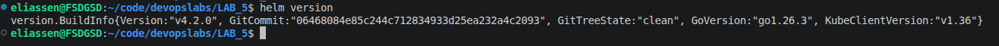
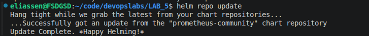
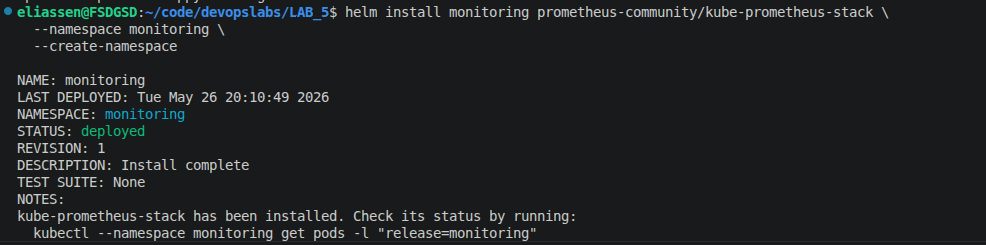
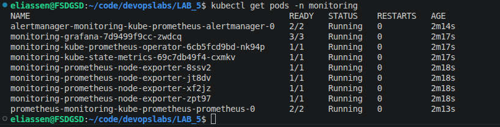
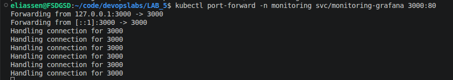
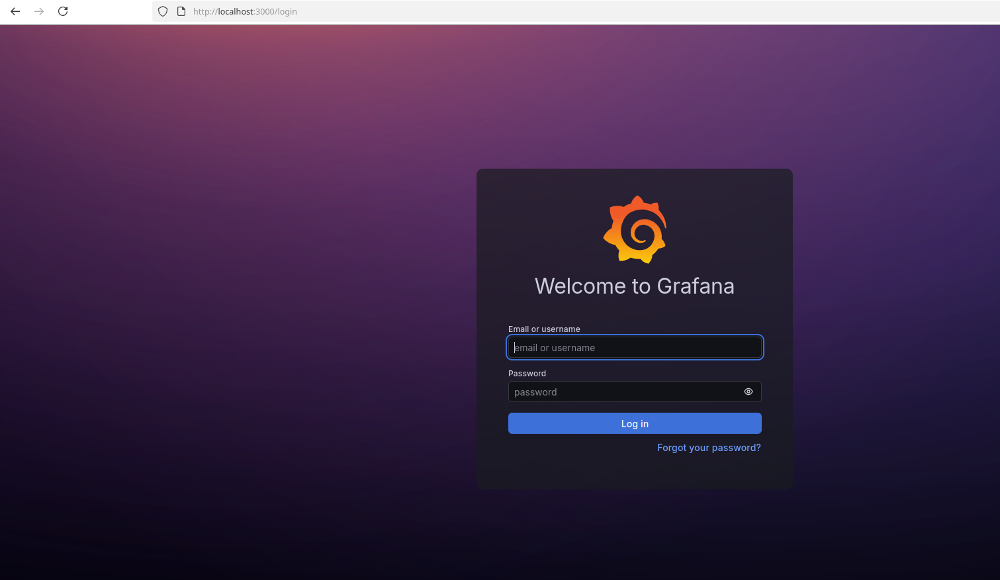
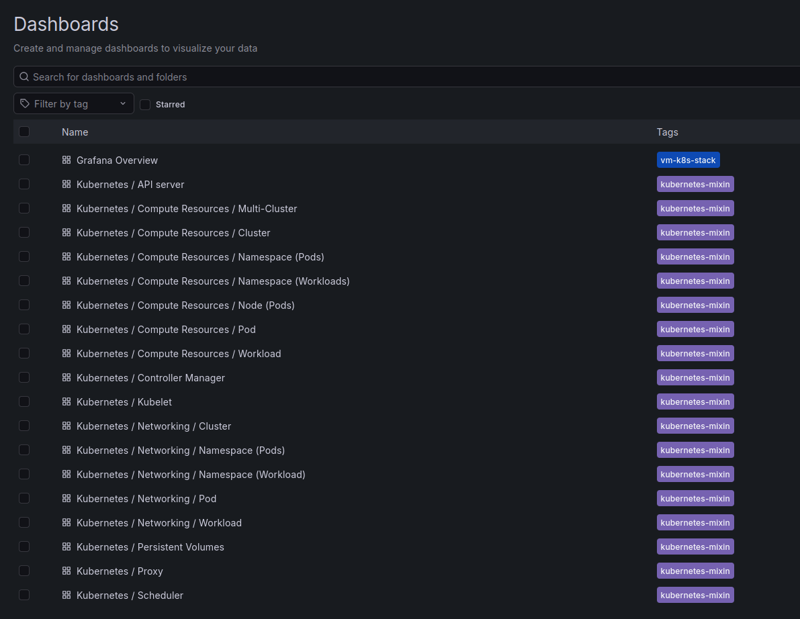
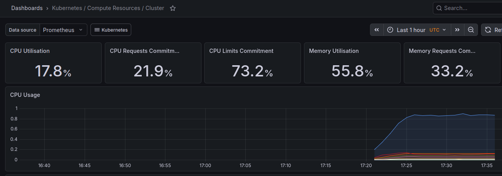
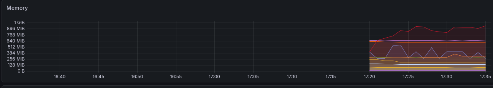

# 5 Лабораторная работа. Мониторинг

В рамках лабораторной работы будет поднят monitoring стек в kubernetes.

Проверим, что helm установлен:


Добавим репозиторий Prometheus Stack


Установим kube-prometheus-stack


Проверим, что поды успешно запустились:


Пробросим порты и получим доступ к Grafana


Вход осуществляется по логину admin, а пароль необходимо достать из secret

```
kubectl get secret -n monitoring monitoring-grafana -o jsonpath="{.data.admin-password}" | base64 -d
```



Список Dashboards:


Ниже приведены примеры графиков метрик в grafana



